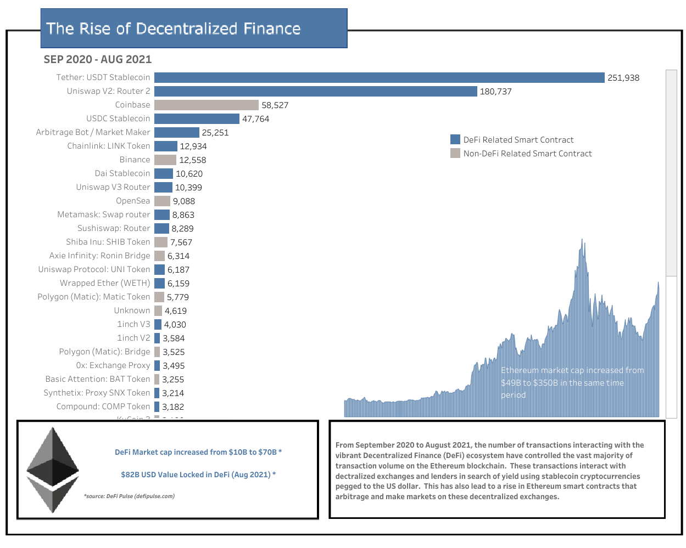

# Tableau-DeFi-Infographic
Tableau Infographic showing the rise in DeFi on Ethereum network from Sep 2020 to Aug 2021.  This was an assignment I submitted for a Data Visualization course in my master's program.

https://public.tableau.com/views/DSC465FinalInfographicRossGibson/Infographic

https://public.tableau.com/app/profile/ross.gibson4865/viz/DSC465TransactionTypeBarChartAnimation/BarChartRaceAnimation

Animation:

